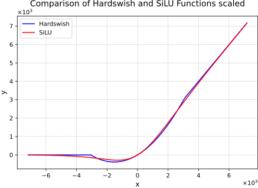
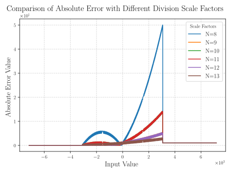
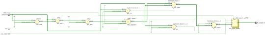
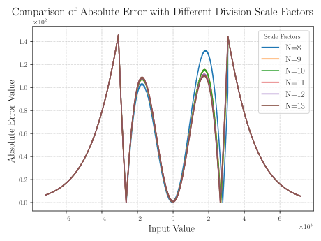

SiLU Activation function
===============================

This document describes the implementation choices and considerations for implementing SiLU activation function in VHDL.
See this `article <https://arxiv.org/pdf/1905.02244>`_ :cite:p:`howard2019searching` for more details.

1. **Overwiew**
---------------

The SiLU (Sigmoid Linear Unit) function is also known as the swish function:

.. math::

    \text{SiLU}(x) = x \times \sigma(x) \text{, where } \sigma(x)=\frac{1}{1+e^{-x}} \text{ is the logistic sigmoid}

This non-linear function is very difficult to compute in hardware. For our project, we can use an approximation where sigmoid function is replaced
with its piece-wise linear hard analog :math:`\frac{\text{ReLU6}(x+3)}{6}`, giving us our approximated SiLU function (also referred as hard-swish):

.. math::

    \text{hard-swish}(x) = x \frac{\text{ReLU6}(x+3)}{6}

The graph of the two functions is shown below:

This approximation, however, leads to slightly different results within this interval. The difference between the actual and approximated values needs to
be quantified to understand the impact on the overall performance of the neural network.

2. **Hardware implementation**
------------------------------

The Hardswish function is implemented using `std_logic_vector`. These approximations, while small, can accumulate over multiple computations and potentially 
affect the final output of the neural network. But calculating it without this approximation is very complex and resource-intensive. To avoid using floating point values,
the input values are scaled by :math:`2^{10}=1024`, so the output of the function is multiplied by this factor.

The division by 6 is the main reason of the accuracy loss. It was implemented using a power of 2 scaling factor to perform:

.. math::

    \frac{1}{6} \approx \frac{2^{\text{N}}}{6} \gg \text{N} \text{ where N is a power of 2}

The higher N, the better the computed accuracy. The following plot shows the absolute error between the **HDL implementation** and **hard-swish** functions:

The error is higher on the polynomial part where the division is computed. The main advantage with this implementaion is that it only requires one addition, two multiplications
and one arithmetic shift as shown below:

The following plot shows the absolute error between the **HDL implementation** and **SiLU** functions:

