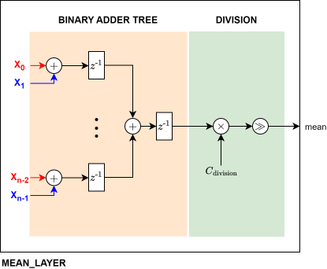

Batchnorm2d Layer
=================

This document describes the implementation choices and considerations for implementing the Batchnorm2d layer in VHDL
Some part are extracted from `Pytorch, BatchNorm2d documentation <https://pytorch.org/docs/stable/_modules/torch/nn/modules/batchnorm.html#BatchNorm2d>`__ .

**1. Overwiew**
---------------

4D is a mini-batch of 2D inputs with additional channel dimension. Method described in the paper
`Batch Normalization: Accelerating Deep Network Training by Reducing Internal Covariate Shift <https://arxiv.org/abs/1502.03167>`__ .

.. math::

    y = \frac{x - \mathrm{E}[x]}{ \sqrt{\mathrm{Var}[x] + \epsilon}} * \gamma + \beta

The mean and standard-deviation are calculated per-dimension over
the mini-batches and :math:`\gamma` and :math:`\beta` are learnable parameter vectors
of size `C` (where `C` is the number of features or channels of the input).

**2. Hardware implementation of mean function**
-----------------------------------------------

The first step for this function is to implement the channel-wise mean function. it performs the basic operation:

.. math::

    \bar{x} = \mathrm{E}[x] = \frac{1}{n}\left (\sum_{i=1}^n{x_i}\right ) = \frac{x_1+x_2+\cdots +x_n}{n}

The only challenge in this function is computing the division, which is handled similarly to the activation function :ref:silu-computation-label.
The implementation is done using the adder tree architecture. The following illustration highlight the computation for one channel:

**3. Hardware implementation of variance function**
---------------------------------------------------

Then, we compute channel-wise the variance, where the variance is:

.. math::

    \operatorname{Var}(X) = \frac{1}{n} \sum_{i=1}^n(x_i - \mathrm{E}[X])^2