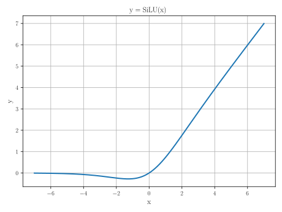

Convolution Layer Architectures
===============================

This document describes the implementation choices and considerations for implementing SiLU activation function in VHDL.

1. **Overwiew*
--------------

The SiLU (Sigmoid Linear Unit) function is also known as the swish function:

.. math::

    \text{SiLU}(x) = x \times \sigma(x) \text{, where } \sigma(x)=\frac{1}{1+e^{-x}} \text{ is the logistic sigmoid}

