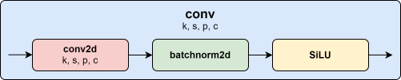

Convolution Layer
=================

This document describes the `conv` layer implementation.

1. **The convolution layer**
----------------------------

The convolution layer is the fundamental building block used in the YOLO.

In the YOLO model, each conv layer is implemented as a sequence of three key components:

1. Conv2D: This performs the 2D convolution operation, applying a set of filters to the input image. The filters slide over the input, performing element-wise multiplication and summation to produce feature maps. This step is crucial for feature extraction.

2. BatchNorm2D: Batch normalization is applied to the output of the Conv2D layer. It normalizes the output by adjusting and scaling the activations, which helps in speeding up the training process and providing some regularization to prevent overfitting.

3. Activation Function: A nonlinear activation function, hardswish in our case, an approximation of SiLU activation function. This allows the network to learn more complex patterns.

Where:

- **k (kernels)**: Number and size of filters applied during convolution.
- **s (stride)**: Step size for moving the filter across the input.
- **p (padding)**: Number of pixels added to the input borders.
- **c (channels)**: Number of output feature maps generated.

1. **Results with a 64x64 image**
---------------------------------

The results were generated using a 64x64 RGB image, with the output displayed through three different filters. The figures below illustrate the effects of each filter:

Each figure demonstrates the impact of the respective filter on the given image, with parameters annotated. In the simulation, with a 100 MHz clock, the image processing time is 450 µs when using a pipelined architecture and 615 µs with a non-pipelined architecture.

Emboss Filter
#############

.. raw:: html
   :file: html/conv/filter_Emboss_heatmap.html

Identity Filter
###############

.. raw:: html
   :file: html/conv/filter_Identity_heatmap.html

Sharp Filter
############

.. raw:: html
   :file: html/conv/filter_Sharp_heatmap.html