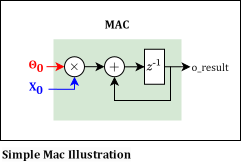

Conv2d Implementation
**********************

The Conv2d layer is a fundamental building block in every Convolutional Neural Network (CNN) model. It is the primary driver of resource usage,
accounting for 3,146,608 out of the total 3,157,200 parameters in the YOLOv8n model, which constitutes 99.66% of the parameters.
Efficient implementation of the Conv2d operation is crucial for the overall performance of the model.
The chosen architecture relies heavily on one component: the Multiplier-Accumulator (MAC).

A MAC is a hardware unit that multiplies two numbers and accumulates the result.
This is particularly advantageous for us because most FPGAs are equipped with numerous DSP blocks, which are essentially MACs.
The following figure illustrates the MAC:

Per channel MAC instantiation is used to limit the number of MACs required while maintaining a correct 
output rate.

Results Example
===============

This is an example of the output of the conv2d layer where the input image is a 64x64 RGB image. The hyperparameters
used are: *Stride=1*, *Padding=1* and with a *Kernel Size=3*. The output size is a 64x64 gray image.

.. raw:: html
   :file: ../_static/html/conv2d_implementation/input_image.html

Here are some examples of the convolutional kernels used in the Conv2d layer:

+-----------+------------------+------------------------------------------------------------------+
| Operation |     Kernels      |                           Image result                           |
+===========+==================+==================================================================+
| Blur      | .. math::        | .. image:: ../_static/images/conv2d_implementation/blur.png      |
|           |                  |                                                                  |
|           |   \frac{1}{9}    |                                                                  |
|           |   \begin{bmatrix}|                                                                  |
|           |   1 & 1 & 1 \\   |                                                                  |
|           |   1 & 1 & 1 \\   |                                                                  |
|           |   1 & 1 & 1      |                                                                  |
|           |   \end{bmatrix}  |                                                                  |
|           |                  |                                                                  |
+-----------+------------------+------------------------------------------------------------------+
| Edge      | .. math::        | .. image:: ../_static/images/conv2d_implementation/edge.png      |
|           |                  |                                                                  |
|           |   \begin{bmatrix}|                                                                  |
|           |   -1 & -1 & -1 \\|                                                                  |
|           |   -1 & 8 & -1 \\ |                                                                  |
|           |   -1 & -1 & -1   |                                                                  |
|           |   \end{bmatrix}  |                                                                  |
|           |                  |                                                                  |
+-----------+------------------+------------------------------------------------------------------+
| Emboss    | .. math::        | .. image:: ../_static/images/conv2d_implementation/emboss.png    |
|           |                  |                                                                  |
|           |   \begin{bmatrix}|                                                                  |
|           |   -2 & -1 & 0 \\ |                                                                  |
|           |   -1 & 1 & 1 \\  |                                                                  |
|           |   0 & 1 & 2      |                                                                  |
|           |   \end{bmatrix}  |                                                                  |
|           |                  |                                                                  |
+-----------+------------------+------------------------------------------------------------------+
| Prewitt X | .. math::        | .. image:: ../_static/images/conv2d_implementation/prewitt_x.png |
|           |                  |                                                                  |
|           |   \begin{bmatrix}|                                                                  |
|           |   -1 & 0 & 1 \\  |                                                                  |
|           |   -1 & 0 & 1 \\  |                                                                  |
|           |   -1 & 0 & 1     |                                                                  |
|           |   \end{bmatrix}  |                                                                  |
|           |                  |                                                                  |
+-----------+------------------+------------------------------------------------------------------+
| Sobel Y   | .. math::        | .. image:: ../_static/images/conv2d_implementation/sobel_y.png   |
|           |                  |                                                                  |
|           |   \begin{bmatrix}|                                                                  |
|           |   -1 & -2 & -1 \\|                                                                  |
|           |   0 & 0 & 0 \\   |                                                                  |
|           |   1 & 2 & 1      |                                                                  |
|           |   \end{bmatrix}  |                                                                  |
|           |                  |                                                                  |
+-----------+------------------+------------------------------------------------------------------+
