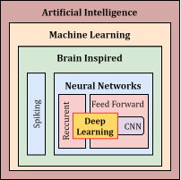
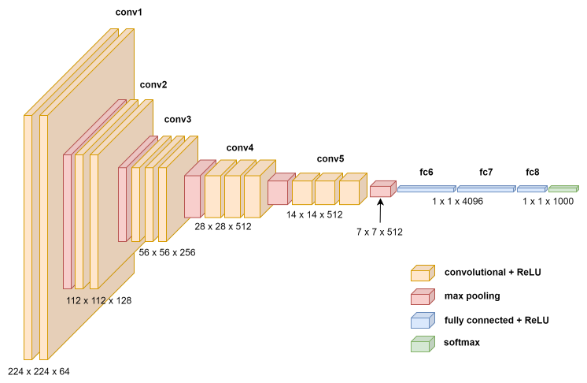
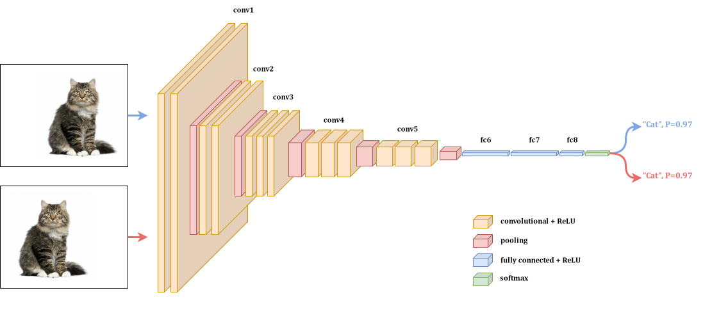

Deep Learning
*************

This section provides an overview of the theory behind Convolutional Neural Networks (CNNs) and deep learning.

Deep Learning Overview
######################

**Deep learning** is a subset of machine learning methods based on neural networks with representation learning. 
The field takes inspiration from biological neuroscience and is centered around stacking artificial neurons 
into layers and "training" them to process data. The adjective "deep" refers to the use of multiple layers 
(ranging from three to several hundred or thousands) in the network (`Deep Learning Wikipedia page <https://en.wikipedia.org/wiki/Deep_learning>`_).

The following Figure illustrate how deep learning is a subset of machine learning and how machine learning is a subset of artificial intelligence (AI):

With representation learning, we just need to feed the model with raw data and the model will learn the features by itself.

Convolutional Neural Networks
#############################

A **Convolutional Neural Network (CNN)** is a deep learning algorithm that learns features by itself via filter (or kernel) optimization.
CNNs are widely used in image and video recognition, recommender systems, and natural language processing.

Architecture
------------

A Convolutional Neural Network consists of an input layer, hidden layers and an output layer. In a Convolutional Neural Network, 
the hidden layers include one or more layers that perform convolutions. Typically this includes a layer that performs a dot product 
of the convolution kernel with the layer's input matrix. There are also other layers that perform operations such as pooling,
batch normalization, and activation functions.

The following Figure illustrates the architecture of VGG16, a popular CNN model:

The 2D Convolutional Layer
---------------------------

The 2D Convolutional Layer is the core building block of a CNN. It applies a set of filters to the input image, sliding over the input,
performing element-wise multiplication and summation to produce feature maps. This step is crucial for feature extraction.

It involves computing a moving dot product between the input image and the filter. The filter is a small matrix that slides over the input image,
computing the dot product at each position. The output is a feature map that highlights the presence of certain features in the input image.

In the simplest case, the output value of the layer with input size
:math:`(N, C_{\text{in}}, H, W)` and output :math:`(N, C_{\text{out}}, H_{\text{out}}, W_{\text{out}})`
can be precisely described as:

.. math::
    \text{out}(N_i, C_{\text{out}_j}) = \text{bias}(C_{\text{out}_j}) +
    \sum_{k = 0}^{C_{\text{in}} - 1} \text{weight}(C_{\text{out}_j}, k) \star \text{input}(N_i, k)

where :math:`\star` is the valid 2D cross-correlation operator,
:math:`N` is a batch size, :math:`C` denotes a number of channels,
:math:`H` is a height of input planes in pixels, and :math:`W` is
width in pixels (see the `PyTorch Doc <https://pytorch.org/docs/stable/generated/torch.nn.Conv2d.html>`_ documentation for more details).

There are many others parameters involved in the convolutional layer:

- **Stride**: The number of pixels by which the filter slides over the input image.
- **Padding**: The number of pixels added to the input image to ensure that the output has the same dimensions as the input.
- **Dilation**: The spacing between the kernel elements (not implented in our case).
- **Groups**: The number of groups that the input and output channels are divided into (not implemented in our case).

See `here <../_static/script/conv_demo/index.html>`_ for a demonstration of the Conv2d layer
(created by `CS231n Stanford University <https://cs231n.github.io/convolutional-networks/>`_).

Some common filters used in the Convolutional Layer are:

The Pooling Layer
-----------------

The Pooling Layer is another important building block of a CNN. It reduces the spatial dimensions of the input image by downsampling.
It is used to reach a shift invariance and to reduce the number of parameters and computations in the network.
Shift invariance means that the network should be able to recognize the same pattern in different parts of the image. The
following Figure illustrates the job of the pooling layer:

There are different types of pooling layers:

- **Max Pooling**: The maximum value of the input image is taken in a certain region.
- **Average Pooling**: The average value of the input image is taken in a certain region.
- **Global Average Pooling**: The average value of the input image is taken over the entire image.

Basically, the pooling layer works like the Conv2d layer but without the weights. It just applies a function within 
a sliding window. 
Pooling enables an invariance to small translations and distortions in the input image. It is not perfect nor 
strong invariance, but with several layers of pooling, the network can learn to be invariant to larger translations.

The Activation Function
-----------------------

The Activation Function is a non-linear function that is applied to the output of the convolutional layer. It introduces non-linearity
to the network, allowing it to learn complex patterns in the data. Without the activation function, the network would be a linear model,
even with multiple layers because a linear combination of linear functions is still a linear function (i.e., the network would be
equivalent to a single fully connected layer). Here are some common activation functions:

+-----------+---------------------------------------------------+----------------------------------------------------+-------------------------+
|   Name    |                      Formula                      |                     Derivative                     |          Range          |
+===========+===================================================+====================================================+=========================+
| ReLU      | :math:`f(x) = \max(0, x)`                         | :math:`f'(x) = 1` if :math:`x > 0`, else :math:`0` | :math:`[0, \infty]`     |
+-----------+---------------------------------------------------+----------------------------------------------------+-------------------------+
| Sigmoid   | :math:`f(x) = \frac{1}{1 + e^{-x}}`               | :math:`f'(x) = f(x) \cdot (1 - f(x))`              | :math:`[0, 1]`          |
+-----------+---------------------------------------------------+----------------------------------------------------+-------------------------+
| Tanh      | :math:`f(x) = \tanh(x)`                           | :math:`f'(x) = 1 - f(x)^2`                         | :math:`[-1, 1]`         |
+-----------+---------------------------------------------------+----------------------------------------------------+-------------------------+
| SiLU      | :math:`f(x) = x \cdot \sigma(x)`                  | :math:`f'(x) = \sigma(x) + x \cdot \sigma'(x)`     | :math:`[-0.28, \infty]` |
+-----------+---------------------------------------------------+----------------------------------------------------+-------------------------+
| Softmax   | :math:`f(x_i) = \frac{e^{x_i}}{\sum_{j} e^{x_j}}` | :math:`f'(x_i) = f(x_i) \cdot (1 - f(x_i))`        | :math:`[0, 1]`          |
+-----------+---------------------------------------------------+----------------------------------------------------+-------------------------+
| HardSwish | :math:`\text{Hardswish}(x) = \begin{cases}        | :math:`f'(x) = \begin{cases}                       | :math:`[0, \infty]`     |
|           | 0 & \text{if~} x \le -3, \\                       | 0 & \text{if~} x \le -3, \\                        |                         |
|           | x & \text{if~} x \ge +3, \\                       | 1 & \text{if~} x \ge +3, \\                        |                         |
|           | x \cdot (x + 3) / 6 & \text{otherwise}            | \frac{2x + 3}{6} & \text{otherwise}                |                         |
|           | \end{cases}`                                      | \end{cases}`                                       |                         |
+-----------+---------------------------------------------------+----------------------------------------------------+-------------------------+

Choosing the right activation function is crucial for the network and entirely depends on the problem at hand. It is all about 
the datas and what we want to learn from them. For instance, Softmax is used for multi-class classification problems, while ReLU is
used for most other problems.

But some activation functions can lead to the vanishing gradient problem. This problem occurs when the gradient of the activation
function is very small, causing the network to learn very slowly. This is why Batch Normalization is used to normalize the input of
the activation function, making the training faster and more stable. It has no impact on the inference phase.

The Batch Normalization Layer
------------------------------

The Batch Normalization Layer is a layer that normalizes the input of the activation function. It is used to stabilize and speed up
the training of deep neural networks. It performs the following operations before the activation function:

.. math::
   y = \frac{x - \mathrm{E}[x]}{ \sqrt{\mathrm{Var}[x] + \epsilon}} * \gamma + \beta

The mean and standard-deviation are calculated per-dimension over
the mini-batches and :math:`\gamma` and :math:`\beta` are learnable parameter vectors
of size `C` (where `C` is the input size).

Method described in the paper `Batch Normalization: Accelerating Deep Network Training by Reducing
Internal Covariate Shift <https://arxiv.org/abs/1502.03167>`__ :cite:p:`ioffe2015batchnormalizationacceleratingdeep`.

The following Figure illustrates the Vanishing Gradient Problem and how Batch Normalization solves it by "re-centering" the datas
where the derivative of the activation function is the highest:

.. raw:: html
   :file: ../_static/html/deep_learning/sigmoid_vanishing_gradient.html

The Fully Connected Layer
--------------------------

The Fully Connected Layer is a layer where each neuron is connected to every neuron in the previous layer. It is used to combine
features from the convolutional layers and make a decision. The Fully Connected Layer is typically used at the end of the network
to make a prediction.