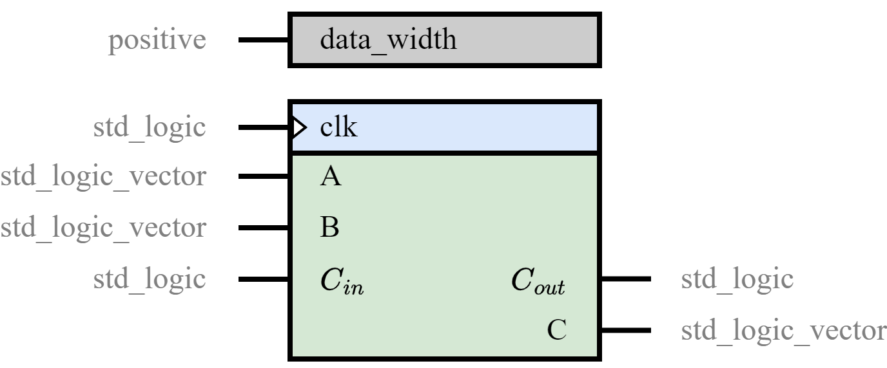

.. _module_common:

Module common 
=============

.. _common.full_adder:
full_adder.v 
------------

.. code-block:: verilog
    :linenos:
    :caption: Full adder module

    module full_adder (
        input a, 
        input b,
        input cin,
        output sum,
        output cout
    );

        // Full adder combinational logic
        assign sum  = a ^ b ^ cin;
        assign cout = ((a ^ b) & cin) | (a & b);

    endmodule

:math:`\text{sum}= a~\oplus~b~\oplus~c`

:math:`c_{out}  = ((a~\oplus~b)~\&~c_{in})~|~(a~\&~b)`

.. _common.ripple_carry_adder:
ripple_carry_adder.v 
--------------------

.. code-block:: verilog
    :linenos:
    :caption: Ripple Carry Adder

    module adder100 (
        input [99:0] a,
        input [99:0] b,
        input cin,
        output cout,
        output [99:0] sum
    );

        assign {cout, sum} = a + b + cin;

    endmodule

The **drawback** of the ripple carry adder is that the delay for an adder to compute the carry out (from the carry-in, in the worst case) is fairly slow, and the second-stage adder cannot begin computing its carry-out until the first-stage adder has finished.
